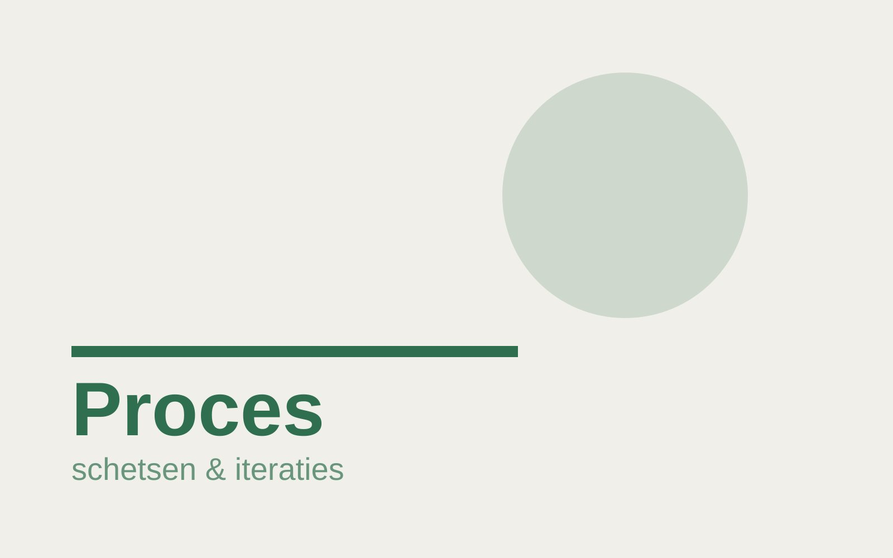
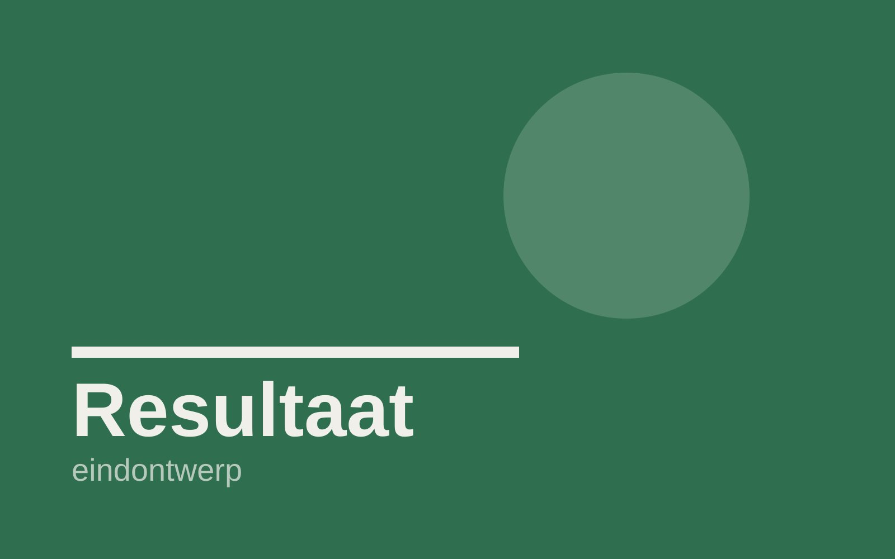

## De vraag

Vervang deze tekst door de briefing: wat was het probleem, voor wie, en wat moest het ontwerp bereiken?

## Aanpak

Beschrijf hoe je het hebt aangepakt: onderzoek, moodboards, eerste schetsen, keuzes die je maakte en waarom.

## Resultaat

Vertel wat het eindresultaat is geworden en wat je eruit geleerd hebt.

